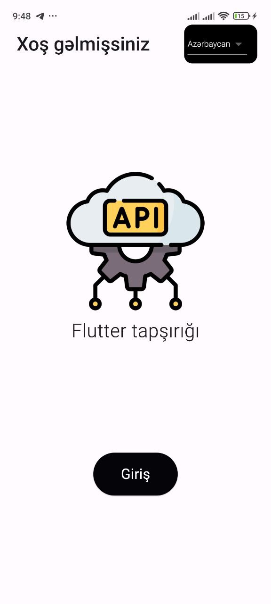
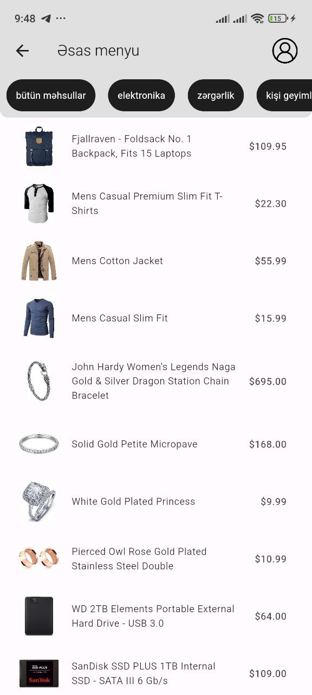
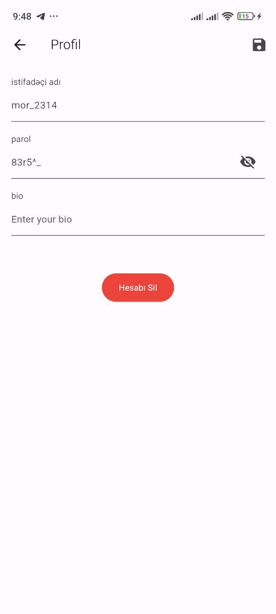

# Flutter Task App

This Flutter Task App is designed as a demonstration project for entry-level Flutter developer positions. It showcases fundamental Flutter concepts and features required for beginner developers.

## Features

- **Simple UI**: Clean and intuitive user interface for better user experience.
- **State Management**: Utilizes Flutter's state management techniques for efficient app performance.

## Screenshots

Here are some screenshots of the app:

1. Welcome Screen
   

2. Home Screen
   

3. Profile Screen
   

## Getting Started

To get started with this project, follow this step:

1. Clone the repository:

   ```bash
   git clone https://github.com/developedbyamin/flutterapitask.git
    ```